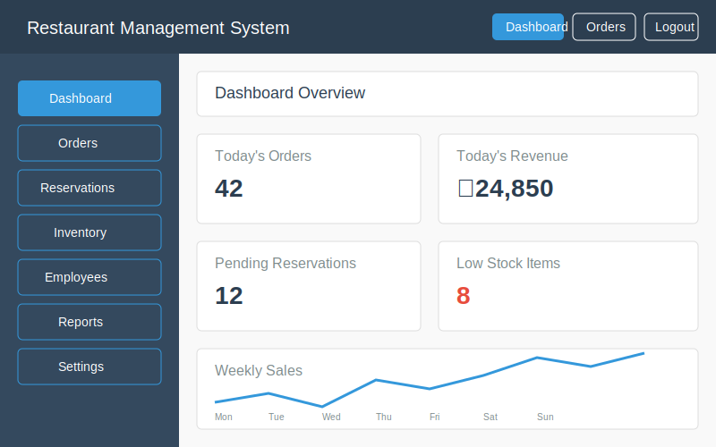
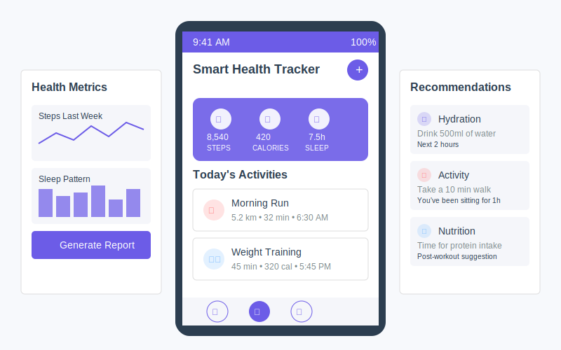
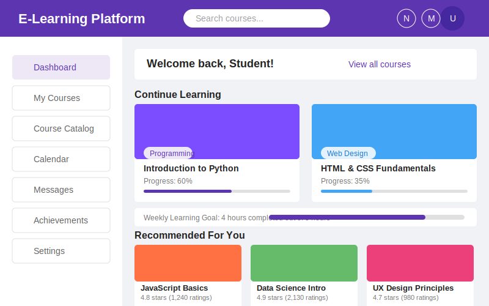

# 👋 สวัสดีครับ, ยินดีต้อนรับสู่ GitHub ของฉัน!

  

## 👨‍💻 เกี่ยวกับฉัน

นักพัฒนาซอฟต์แวร์ Full Stack ที่มีประสบการณ์ในการพัฒนาเว็บแอปพลิเคชัน ฉันชื่นชอบการสร้างโซลูชั่นที่มีประสิทธิภาพและการนำเทคโนโลยีใหม่ๆ มาประยุกต์ใช้ในโปรเจกต์ มีความสนใจเป็นพิเศษในด้าน DevOps และ Cloud Infrastructure

- 🔭 ปัจจุบันฉันกำลังทำงานเกี่ยวกับ **[Freelance]**
- 🌱 กำลังศึกษาเพิ่มเติมเกี่ยวกับ **[LLM]**
- 👯 มองหาโอกาสร่วมงานกับ **[DevSecOps and Claude Infrastructure]**
- 💬 สอบถามเกี่ยวกับ **[Web front-End Back-End DevOps]**
- 📫 ติดต่อฉัน: **[kuhakuzaza@gmail.com]**

## 🛠️ ทักษะและระดับความชำนาญ

### 💻 ภาษาโปรแกรมมิ่ง
| เทคโนโลยี | ระดับความชำนาญ |
| --------- | ------------- |
|  | ⭐⭐⭐⭐⭐ |
|  | ⭐⭐⭐⭐ |
|  | ⭐⭐⭐⭐ |
|  | ⭐⭐⭐⭐ |
|  | ⭐⭐⭐ |
|  | ⭐⭐ |
|  | ⭐⭐⭐ |

### 🎨 Frontend
| เทคโนโลยี | ระดับความชำนาญ |
| --------- | ------------- |
|  | ⭐⭐⭐⭐⭐ |
|  | ⭐⭐⭐⭐⭐ |
|  | ⭐⭐⭐⭐ |
|  | ⭐⭐⭐ |
|  | ⭐⭐ |
|  | ⭐⭐⭐⭐ |
|  | ⭐⭐⭐⭐⭐ |
|  | ⭐⭐⭐⭐ |
|  | ⭐⭐ |
|  | ⭐⭐ |

### 🔧 Backend
| เทคโนโลยี | ระดับความชำนาญ |
| --------- | ------------- |
|  | ⭐⭐⭐⭐⭐ |
|  | ⭐⭐⭐⭐ |
|  | ⭐⭐⭐ |
|  | ⭐⭐⭐ |
|  | ⭐⭐⭐⭐ |
|  | ⭐⭐ |
|  | ⭐⭐ |
|  | ⭐⭐⭐ |
|  | ⭐⭐ |
|  | ⭐⭐⭐ |

### 🗄️ Database
| เทคโนโลยี | ระดับความชำนาญ |
| --------- | ------------- |
|  | ⭐⭐⭐⭐ |
|  | ⭐⭐⭐⭐ |
|  | ⭐⭐⭐⭐ |
|  | ⭐⭐⭐ |
|  | ⭐⭐⭐ |
|  | ⭐⭐⭐⭐ |
|  | ⭐⭐ |
|  | ⭐⭐⭐ |

### 🚀 DevOps
| เทคโนโลยี | ระดับความชำนาญ |
| --------- | ------------- |
|  | ⭐⭐⭐⭐ |
|  | ⭐⭐⭐ |
|  | ⭐⭐⭐ |
|  | ⭐⭐⭐⭐ |
|  | ⭐⭐⭐ |
|  | ⭐⭐ |
|  | ⭐⭐ |
|  | ⭐⭐ |
|  | ⭐⭐ |
|  | ⭐⭐⭐⭐ |

### ☁️ Cloud & Infrastructure
| เทคโนโลยี | ระดับความชำนาญ |
| --------- | ------------- |
|  | ⭐⭐ |
|  | ⭐⭐⭐ |
|  | ⭐⭐⭐ |
|  | ⭐⭐ |
|  | ⭐⭐⭐ |
|  | ⭐⭐⭐ |
|  | ⭐⭐⭐⭐ |
|  | ⭐⭐⭐⭐ |
|  | ⭐⭐⭐⭐ |

### 🔍 Testing
| เทคโนโลยี | ระดับความชำนาญ |
| --------- | ------------- |
|  | ⭐⭐⭐⭐ |
|  | ⭐⭐⭐ |
|  | ⭐⭐⭐ |
|  | ⭐⭐⭐ |
|  | ⭐⭐ |

## 📊 สถิติ GitHub ของฉัน

  

  

  

## 📝 ภาษาที่ใช้บ่อยที่สุด

  

## 🌟 ความชำนาญของฉัน

### 💼 ทักษะทางเทคนิค
- **ชำนาญเป็นพิเศษ (⭐⭐⭐⭐⭐):** JavaScript, HTML5, CSS3, Node.js
- **ชำนาญมาก (⭐⭐⭐⭐):** TypeScript, Python, React, Next.js, Express.js, Flask, PostgreSQL, MySQL, MongoDB, Docker, GitHub Actions, AWS
- **ชำนาญ (⭐⭐⭐):** Vue.js, Golang, PHP, Java, NestJS, Django, Redis, Kubernetes, Jenkins, Terraform

### 🧩 ประสบการณ์โปรเจกต์ด้าน DevOps
- **CI/CD Automation:** พัฒนาไปป์ไลน์อัตโนมัติสำหรับการทดสอบและการปรับใช้งาน
- **Container Orchestration:** บริหารจัดการแอปพลิเคชันที่ใช้งานบนคอนเทนเนอร์ด้วย Docker และ Kubernetes
- **Infrastructure as Code:** ออกแบบและจัดการโครงสร้างพื้นฐานด้วย Terraform และ AWS CloudFormation
- **Monitoring & Logging:** ติดตั้งและกำหนดค่า Prometheus, Grafana, และ ELK Stack

### 🏗️ ประสบการณ์ด้าน Infrastructure
- **Cloud Platforms:** ออกแบบและจัดการทรัพยากรบน AWS, GCP, Azure
- **Networking:** จัดการ VPC, Subnets, Load Balancers, และ Security Groups
- **Security:** ติดตั้งและกำหนดค่า Firewalls, VPNs, และ SSL Certificates

## 🏆 ผลงานที่ภาคภูมิใจ

### [Restaurant Management System]
ระบบ [ระบบบริหารจัดการร้านอาหารแบบครบวงจรที่พัฒนาด้วย MERN Stack และ PostgreSQL เป็นฐานข้อมูลหลัก โปรเจกต์นี้ช่วยแก้ปัญหาการจัดการคำสั่งซื้อ การจองโต๊ะ และการบริหารสินค้าคงคลังที่มักจะซับซ้อนในร้านอาหารขนาดกลางถึงขนาดใหญ่ ด้วยการรวมระบบเหล่านี้เข้าด้วยกันในแพลตฟอร์มเดียว] 

**เทคโนโลยีที่ใช้:** React, Node.js, PostgreSQL, Docker, AWS

### [Smart Health Tracker]
แอปพลิเคชันติดตามสุขภาพที่ช่วยผู้ใช้ติดตามการออกกำลังกาย อาหาร และการนอนหลับ พร้อมแสดงข้อมูลเชิงลึกและคำแนะนำที่ปรับแต่งเฉพาะบุคคล ฉันได้เรียนรู้การทำงานกับ MongoDB สำหรับการจัดเก็บข้อมูลไม่มีโครงสร้าง และการใช้ Django เป็น REST API สำหรับ Vue.js frontend ตลอดจนการปรับใช้งานบน Kubernetes บน Google Cloud Platform

**เทคโนโลยีที่ใช้:** Vue.js, Django, MongoDB, Kubernetes, GCP

### [E-Learning Platform]
เว็บไซต์แพลตฟอร์มการเรียนรู้ออนไลน์ที่มีระบบการจัดการคอร์สเรียน การสตรีมวิดีโอ และระบบบันทึกความก้าวหน้า โปรเจกต์นี้ช่วยให้ผู้ใช้สามารถเข้าถึงเนื้อหาการเรียนรู้ได้ทุกที่ทุกเวลา มีระบบทดสอบความเข้าใจ และมีแดชบอร์ดวิเคราะห์ผลการเรียนรู้ที่ครอบคลุม

**เทคโนโลยีที่ใช้:** Angular, ASP.NET Core, SQL Server, CI/CD with GitHub Actions, Azure

## 🤝 ติดต่อและเชื่อมต่อกับฉัน

  
  
  
  

---

  
  
ขอบคุณที่แวะมาชมโปรไฟล์ของฉัน!

